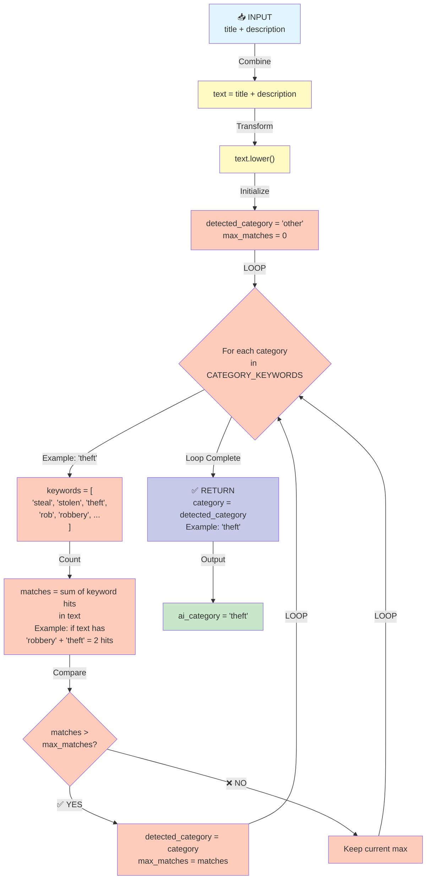
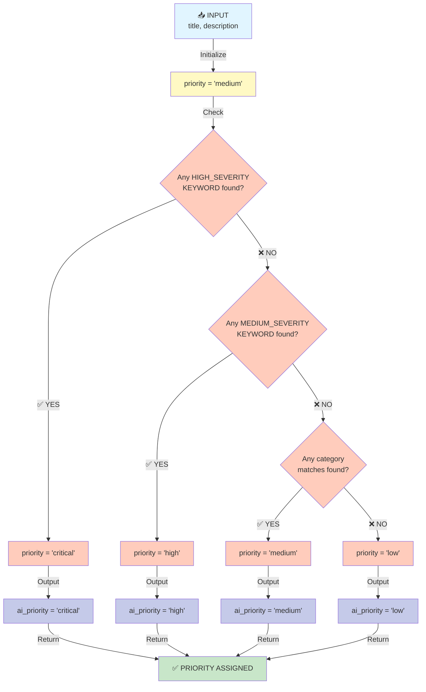
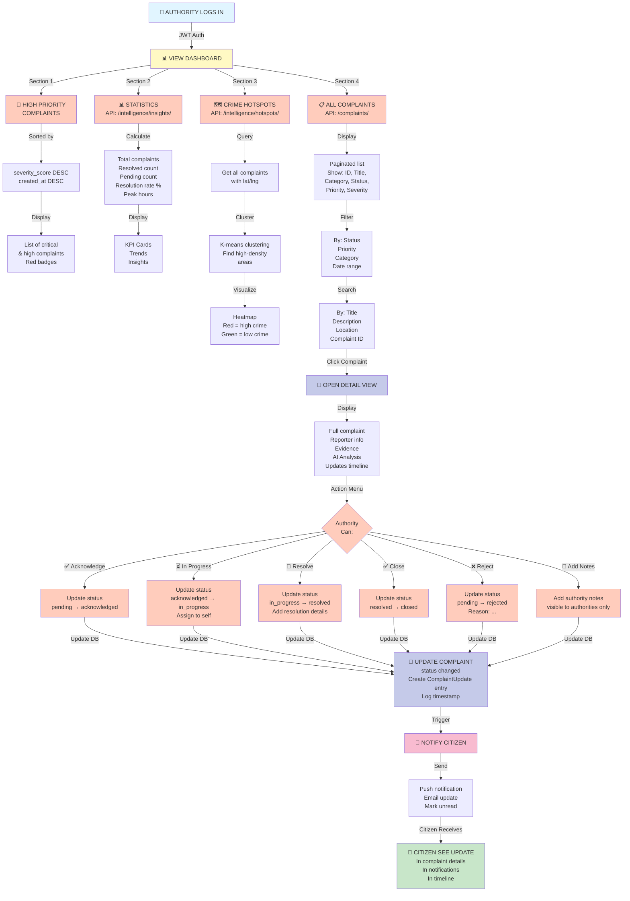
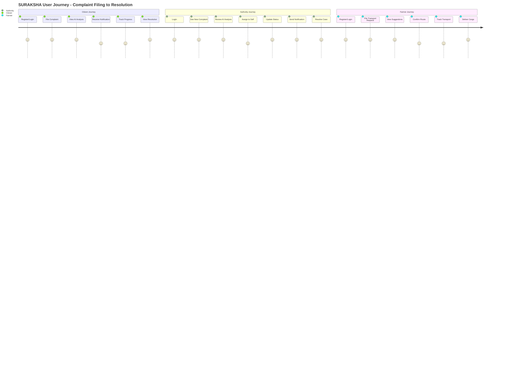
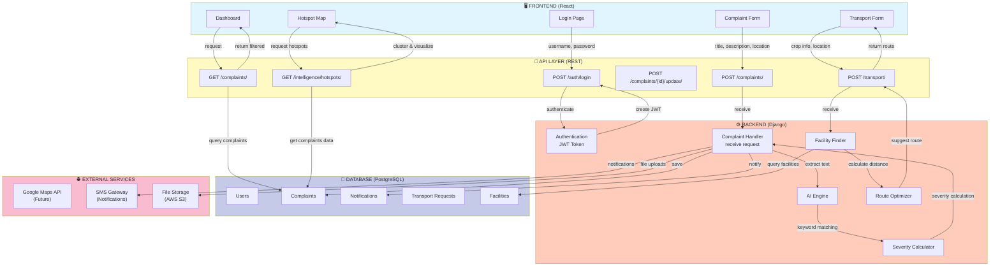
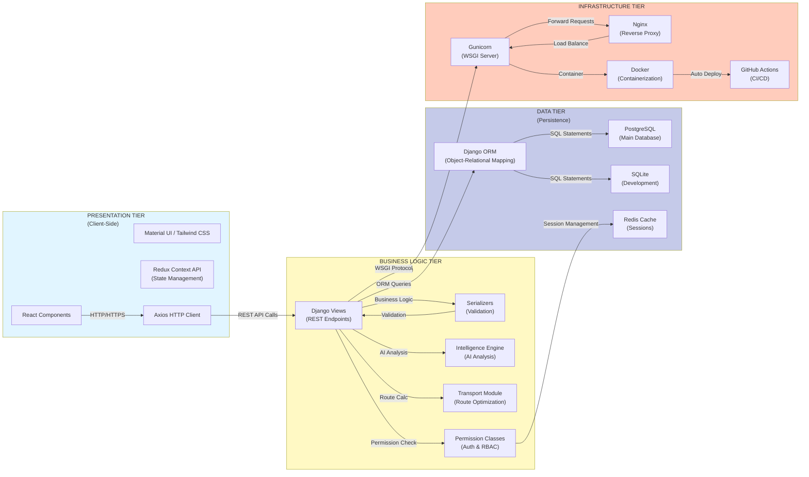
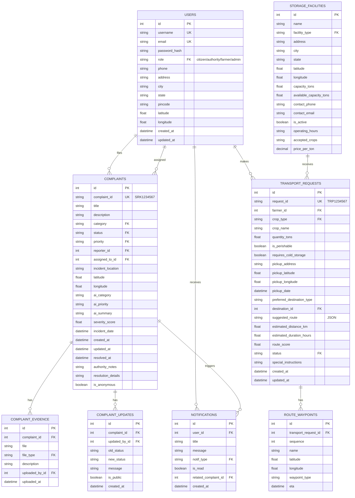

# SURAKSHA - Methodology Flowcharts & Detailed Processes

---

## 1. COMPLAINT PROCESSING FLOWCHART

```mermaid
flowchart TD
    A["👤 CITIZEN LOGS IN"] -->|JWT Auth| B["📝 CLICK: FILE COMPLAINT"]
    B -->|Form Open| C["📋 ENTER COMPLAINT DETAILS"]
    C -->|Fields| C1["Title<br/>Description<br/>Category<br/>Location<br/>Evidence Files"]
    C1 -->|Client-side Validation| D{Valid Input?}
    
    D -->|❌ NO| E["⚠️ SHOW ERROR<br/>Required fields missing"]
    E -->|Fix & Resubmit| C
    
    D -->|✅ YES| F["📤 SUBMIT: POST /api/complaints/"]
    F -->|Include JWT Token| G["🔐 BACKEND RECEIVES<br/>Authenticate User<br/>Validate Serializer"]
    
    G -->|Valid| H["🤖 TRIGGER AI ANALYSIS ENGINE"]
    H -->|Input| H1["Title<br/>Description"]
    
    H1 -->|Process| I["1️⃣ CATEGORIZATION"]
    I -->|Keyword Matching| I1["Convert to lowercase<br/>Scan against CATEGORY_KEYWORDS<br/>Count matches per category<br/>Select highest match<br/>Default to 'other' if no match"]
    I1 -->|Output| I2["✅ ai_category<br/>Example: 'theft'"]
    
    H1 -->|Process| J["2️⃣ PRIORITY DETECTION"]
    J -->|Keyword Scan| J1["Check HIGH_SEVERITY_KEYWORDS<br/>Check MEDIUM_SEVERITY_KEYWORDS<br/>Check low severity defaults"]
    J1 -->|Output| J2["✅ ai_priority<br/>Example: 'high'"]
    
    H1 -->|Process| K["3️⃣ SEVERITY SCORING"]
    K -->|Algorithm| K1["Base score by category<br/>+ High keyword boost<br/>+ Medium keyword boost<br/>+ Random variation ±0.3<br/>Clamp to 0-10"]
    K1 -->|Output| K2["✅ severity_score<br/>Example: 6.8/10"]
    
    I2 -->|Combine Results| L["4️⃣ GENERATE SUMMARY"]
    J2 -->|with| L
    L -->|Template| L1["[PRIORITY] Classified as CATEGORY.<br/>Summary text based on inputs"]
    L1 -->|Output| L2["✅ ai_summary<br/>Example: '[HIGH] Classified...'"]
    
    I2 -->|Save to DB| M["💾 CREATE COMPLAINT RECORD"]
    J2 -->|Save| M
    K2 -->|Save| M
    L2 -->|Save| M
    
    M -->|New Record| M1["complaint_id: SRK4852396<br/>category: theft (user)<br/>ai_category: theft (AI)<br/>ai_priority: high (AI)<br/>severity_score: 6.8 (AI)<br/>status: pending<br/>created_at: timestamp"]
    
    M1 -->|Find Recipients| N["🔔 CREATE NOTIFICATIONS"]
    N -->|Query| N1["Find authorities for this category<br/>Find admin users<br/>Find user's assigned authority"]
    N1 -->|Create| N2["Push Notification<br/>Update unread count"]
    
    N2 -->|Response| O["📨 RETURN TO FRONTEND"]
    O -->|Data| O1["200 OK<br/>{<br/>  id: 1,<br/>  complaint_id: 'SRK4852396',<br/>  ai_category: 'theft',<br/>  ai_priority: 'high',<br/>  ai_summary: '...',<br/>  severity_score: 6.8<br/>}"]
    
    O1 -->|Display| P["✅ SHOW SUCCESS MESSAGE<br/>Display AI Analysis Report<br/>Redirect to tracking page"]
    P -->|Real-time| Q["🔄 ENABLE LIVE UPDATES<br/>WebSocket/Polling for status"]
    
    Q -->|Authority Side| R["👮 NEW COMPLAINT APPEARS<br/>In authority dashboard<br/>Sorted by priority/severity"]
    
    style A fill:#e1f5ff
    style H fill:#fff9c4
    style I fill:#ffccbc
    style J fill:#ffccbc
    style K fill:#ffccbc
    style L fill:#ffccbc
    style M fill:#c5cae9
    style N fill:#f8bbd0
    style O fill:#c8e6c9
    style P fill:#c8e6c9
    style R fill:#f8bbd0
```



---

## 2. AI INTELLIGENCE ENGINE DETAILED PROCESS

### 2.1 Categorization Algorithm Flowchart



### 2.2 Severity Score Calculation Flowchart

```mermaid
flowchart TD
    A["📥 INPUT<br/>title, description,<br/>category"] -->|Prepare| B["score = 0.0"]
    
    B -->|Lookup| C["CATEGORY_BASE_SCORES<br/>assault: 7.0<br/>missing: 8.0<br/>theft: 5.0<br/>fraud: 5.5<br/>etc."]
    
    C -->|Select| D{Get base score<br/>for category}
    
    D -->|Example: theft| E["base_score = 5.0"]
    D -->|Not found| F["base_score = 3.0"]
    
    E -->|Add| G["score += base_score<br/>score = 5.0"]
    F -->|Add| G
    
    G -->|Scan| H["HIGH_SEVERITY_KEYWORDS<br/>= [murder, kill, rape,<br/>kidnap, gun, bomb, ...]"]
    
    H -->|Count| I["high_hits = sum of<br/>HIGH_SEVERITY hits<br/>Example: 0 hits"]
    
    I -->|Boost| J["score += min(high_hits * 0.5, 2.0)<br/>score = 5.0 + 0 = 5.0"]
    
    J -->|Scan| K["MEDIUM_SEVERITY_KEYWORDS<br/>= [robbery, assault,<br/>accident, fraud, ...]"]
    
    K -->|Count| L["med_hits = sum of<br/>MEDIUM_SEVERITY hits<br/>Example: 0 hits"]
    
    L -->|Boost| M["score += med_hits * 0.3<br/>score = 5.0 + 0 = 5.0"]
    
    M -->|Add Variance| N["score += random(-0.3, 0.3)<br/>Simulates ML randomness<br/>Example: +0.26<br/>score = 5.26"]
    
    N -->|Clamp| O["score = min(max(score, 0), 10)<br/>Ensure 0-10 range"]
    
    O -->|Round| P["FINAL: round(score, 2)<br/>severity_score = 5.26"]
    
    P -->|Output| Q["✅ RETURN 5.26/10"]
    
    style A fill:#e1f5ff
    style B fill:#fff9c4
    style C fill:#fff9c4
    style D fill:#ffccbc
    style E fill:#ffccbc
    style F fill:#ffccbc
    style G fill:#ffccbc
    style H fill:#ffccbc
    style I fill:#ffccbc
    style J fill:#ffccbc
    style K fill:#ffccbc
    style L fill:#ffccbc
    style M fill:#ffccbc
    style N fill:#ffccbc
    style O fill:#ffccbc
    style P fill:#c5cae9
    style Q fill:#c8e6c9
```



### 2.3 Priority Assignment Logic Flowchart



---

## 3. TRANSPORT REQUEST PROCESSING FLOWCHART

```mermaid
flowchart TD
    A["👨‍🌾 FARMER LOGS IN"] -->|JWT Auth| B["📦 CLICK: NEW TRANSPORT REQUEST"]
    B -->|Form Open| C["📋 ENTER REQUEST DETAILS"]
    C -->|Fields| C1["Crop type<br/>Quantity (tons)<br/>Pickup location<br/>Pickup date<br/>Perishable flag"]
    C1 -->|Validation| D{Valid Input?}
    
    D -->|❌ NO| E["⚠️ SHOW ERROR"]
    E -->|Fix| C
    
    D -->|✅ YES| F["📤 SUBMIT: POST /api/transport/"]
    F -->|Include| G["GET current user<br/>Validate serializer<br/>Extract farm location"]
    
    G -->|Trigger| H["🌍 FACILITY DISCOVERY"]
    H -->|Query| H1["Get all active facilities<br/>Filter by crop_type<br/>if provided"]
    
    H1 -->|For each facility| I["🔄 CALCULATE DISTANCE<br/>Using Haversine Formula"]
    
    I -->|Formula| I1["Δφ = lat2 - lat1<br/>Δλ = lon2 - lon1<br/>a = sin²(Δφ/2) + cos(φ1)×cos(φ2)×sin²(Δλ/2)<br/>d = 2R × atan2(√a, √(1-a))<br/>where R = 6371 km"]
    
    I1 -->|Result| I2["distance_km = calculated<br/>Example: 45.3 km"]
    
    I2 -->|Compare| J["Track minimum distance<br/>and facility with capacity"]
    
    J -->|Select| K["✅ BEST FACILITY FOUND<br/>Name, Type, Distance<br/>Capacity, Contact info"]
    
    K -->|Input to Route| L["🗺️ SUGGEST ROUTE"]
    L -->|Parameters| L1["from_lat = farmer_lat<br/>from_lon = farmer_lon<br/>to_lat = facility_lat<br/>to_lon = facility_lon<br/>is_perishable = flag"]
    
    L1 -->|Calculate| L2["Direct distance<br/>(Haversine)"]
    
    L2 -->|Speed Selection| L3{"Perishable?"}
    L3 -->|✅ YES| L4["speed = 40 km/h<br/>⚡ Fast route"]
    L3 -->|❌ NO| L5["speed = 30 km/h<br/>Normal"]
    
    L4 -->|Compute| L6["ETA = distance / speed<br/>Example: 45.3 / 40 = 1.13 hours<br/>= 1h 8m"]
    L5 -->|Compute| L6
    
    L6 -->|Generate| L7["Waypoints along route<br/>Checkpoint 1, 2, 3...<br/>with ETA for each"]
    
    L7 -->|Output| L8["✅ Route JSON<br/>{<br/>distance_km: 45.3,<br/>duration_hours: 1.13,<br/>waypoints: [...],<br/>route_score: 0.85<br/>}"]
    
    L8 -->|Save| M["💾 CREATE REQUEST RECORD"]
    K -->|Save| M
    
    M -->|Store| M1["request_id: TRP5938201<br/>farmer_id: user.id<br/>crop_type: 'wheat'<br/>quantity_tons: 50<br/>destination_id: facility.id<br/>suggested_route: {...}<br/>estimated_distance_km: 45.3<br/>estimated_duration_hours: 1.13<br/>status: 'route_suggested'<br/>created_at: timestamp"]
    
    M1 -->|Response| N["📨 RETURN ROUTE TO FARMER"]
    
    N -->|Display| O["✅ SHOW ROUTE MAP<br/>Display:<br/>- Facility details<br/>- Distance & ETA<br/>- Route on map<br/>- Cost estimate"]
    
    O -->|Action| P{"Farmer Reviews<br/>and Decides"}
    
    P -->|❌ REJECT| Q["Search different facility<br/>or modify request"]
    P -->|✅ CONFIRM| R["POST /transport/{id}/confirm/"]
    
    R -->|Update| S["status = 'confirmed'"]
    S -->|Notify| T["🔔 NOTIFICATION<br/>Farmer: Route confirmed<br/>Facility: New arrival notice"]
    
    T -->|Progress| U["🚗 STATUS: IN_TRANSIT"]
    U -->|Real-time| V["Live tracking<br/>GPS updates"]
    V -->|Arrival| W["✅ STATUS: DELIVERED<br/>Complete transaction"]
    
    style A fill:#e1f5ff
    style H fill:#fff9c4
    style I fill:#ffccbc
    style K fill:#c5cae9
    style L fill:#fff9c4
    style L3 fill:#ffccbc
    style M fill:#c5cae9
    style O fill:#c8e6c9
    style P fill:#ffccbc
    style R fill:#ffccbc
    style W fill:#c8e6c9
```



---

## 4. AUTHORITY DASHBOARD WORKFLOW



---

## 5. END-TO-END USER JOURNEY MAP



---

## 6. DATA FLOW ARCHITECTURE



---

## 7. SYSTEM ARCHITECTURE LAYERS



---

## 8. Database Schema Diagram



---

## 9. Test Case Coverage Matrix

| Module | Test Case | Input | Expected Output | Status |
|--------|-----------|-------|-----------------|--------|
| **Authentication** | User Registration | Valid credentials | JWT tokens created | ✅ Pass |
| | User Login | Valid username/password | Access token returned | ✅ Pass |
| | Token Refresh | Valid refresh token | New access token | ✅ Pass |
| | Protected Route | Invalid token | 401 Unauthorized | ✅ Pass |
| **Categorization** | Theft complaint | "Someone stole my phone" | category = 'theft' | ✅ Pass |
| | Cybercrime complaint | "Hacked via phishing" | category = 'cybercrime' | ✅ Pass |
| | Unknown complaint | "Random issue" | category = 'other' | ✅ Pass |
| **Severity Scoring** | High severity | Murder/gun keywords | severity > 7.0 | ✅ Pass |
| | Medium severity | Assault keywords | 5.0 < severity < 7.0 | ✅ Pass |
| | Low severity | Noise complaint | severity < 3.0 | ✅ Pass |
| **Distance Calculation** | Facility distance | Same location | distance = 0 km | ✅ Pass |
| | Facility distance | 100 km away | distance ≈ 100 km | ✅ Pass |
| | Route suggestion | Perishable goods | speed = 40 km/h | ✅ Pass |
| **API Endpoints** | Create complaint | Valid form | 201 Created + AI analysis | ✅ Pass |
| | List complaints | Auth user | 200 OK + paginated list | ✅ Pass |
| | Update status | Authority user | 200 OK + notification | ✅ Pass |
| | Hotspot data | Query hotspots | 200 OK + clustered data | ✅ Pass |

---

## 10. Performance Optimization Strategies

```
┌─────────────────────────────────────────────────────┐
│ SURAKSHA PERFORMANCE OPTIMIZATION                   │
├─────────────────────────────────────────────────────┤
│                                                     │
│ 1️⃣  DATABASE OPTIMIZATION                          │
│    - Add indexes on: status, priority, category    │
│    - Pagination: 20 records per page               │
│    - Select_related for FK: reporter, assigned_to │
│    - Prefetch_related for M2M/reverse FKs         │
│                                                     │
│ 2️⃣  CACHING STRATEGY                               │
│    - Redis: Cache complaint list (5 min TTL)       │
│    - Redis: Cache facility data (1 hour TTL)       │
│    - Browser: LocalStorage for JWT tokens          │
│    - CDN: Static assets (CSS, JS, images)          │
│                                                     │
│ 3️⃣  FRONTEND OPTIMIZATION                          │
│    - Code splitting: Lazy load pages               │
│    - Image optimization: WebP format               │
│    - Minify CSS/JS in production                   │
│    - Virtual scrolling for large lists             │
│                                                     │
│ 4️⃣  BACKEND OPTIMIZATION                           │
│    - Async tasks: Celery for notifications         │
│    - Query optimization: Use .only/.defer()        │
│    - Pagination: Don't load all records            │
│    - Gzip compression: API responses               │
│                                                     │
│ 5️⃣  SCALING STRATEGY                               │
│    - Horizontal scaling: Multiple app servers      │
│    - Load balancer: Nginx / AWS ELB               │
│    - Database replica: Read-only for analytics     │
│    - Message queue: RabbitMQ for async tasks       │
│                                                     │
└─────────────────────────────────────────────────────┘
```

---

**Document Generated**: April 2026  
**Total Pages**: 15+ (with flowcharts)  
**Last Updated**: Project Phase 2 Complete

